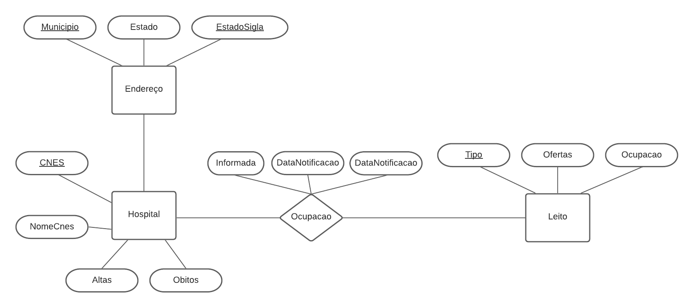

# Modelo para Apresentação do Lab01 - API Acesso

Estrutura de pastas:

~~~
├── README.md  <- arquivo apresentando a tarefa
│
├── images     <- arquivo de imagem da tarefa
│
└── notebook   <- arquivos do notebook
~~~

# Aluno
* `Leonardo Rener de Oliveira`

## Tarefa 1 sobre APIs de acesso

[Laboratório 1](lab01-api.ipynb)

## Tarefa 2 sobre Engenharia Reversa

> 
