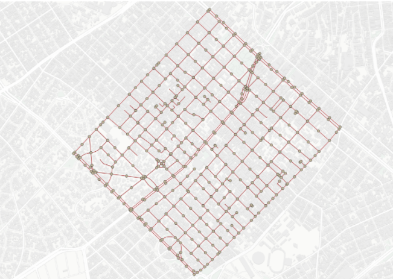

# Modelo para Apresentação do Lab06 - Artigo de Dataset Público

Estrutura de pastas:

~~~
├── README.md  <- arquivo apresentando a tarefa
│
└── images     <- arquivos de imagem usados na tarefa
~~~

# Aluno
* `201270`: `<Leonardo Rener de Oliveira>`

# Análise do Artigo `<PolRoute-DS: um Dataset de Dados Criminais para Geração de Rotas de Patrulhamento Policial>`

|------------|----------------------------------------------------------------------------|
| referência | `<Secretaria da Segurança Publica>`                                        |
| link       | `<https://drive.google.com/file/d/10Q_T1TANC5BtEBpPexsTv7-gfOLva5X2/view>` |
| dataset    | `<https://osf.io/mxrgu/>`                                                  |
| formato    | `<CSV e PostgreSQL>`                                                       |

## Resumo

Este Dataset busca utilizar dados de criminalidade para gerar de rotas policiais, possibilitando uma melhor 
distribuição de viaturas e prevençao/combate ao crime. Nele as vias das cidades são representadas por grafos 
conexos, a figura abaixo mostra como fica essa representação. Os indices de criminalidade obtidos de fontes 
de dados como a da Secretaria da Segurança Publica.

> 

## Perguntas de pesquisa/análises

> Quais os pontos de maior criminalidade?
> Qual a distribuição de viaturas mais eficiente?
> Qual a rota com menor ou maior indice de criminalidade de um ponto a outro?

## Trabalhos relacionados

Um dos trabalhos relacionados é o Crime Data-Warehouse da Royal Canadian Mounted Police, com dados sobre 
criminalidade na cidade de Burnaby, no Canadá.
