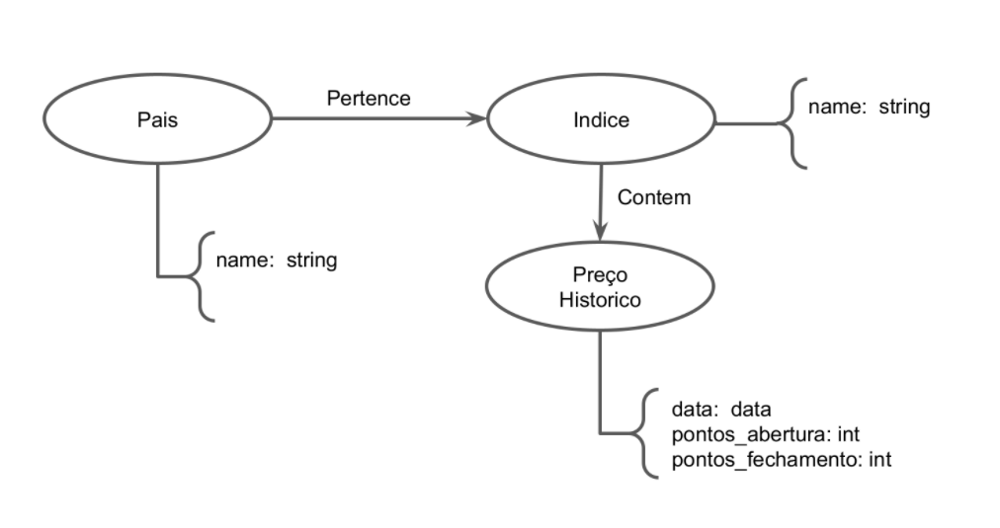

# Modelo para Apresentação do Lab07 - Modelo Lógico para Banco de Dados de Grafos

Estrutura de pastas:

~~~
├── README.md  <- arquivo apresentando a tarefa
│
└── images     <- arquivos de imagem usados na tarefa
~~~

# Aluno
* `201270`: `Leonardo Rener de Oliveira`

## Modelo Lógico do Banco de Dados de Grafos

> 

## Perguntas de Pesquisa/análise

> * Como foi a evolução de um índice de investimento de um determinado país?
> * Quais os paises com melhor desempenho dos indices durante um periodo?
> * Pesquisa sobre a relação bolsa de investimentos com a economia.
