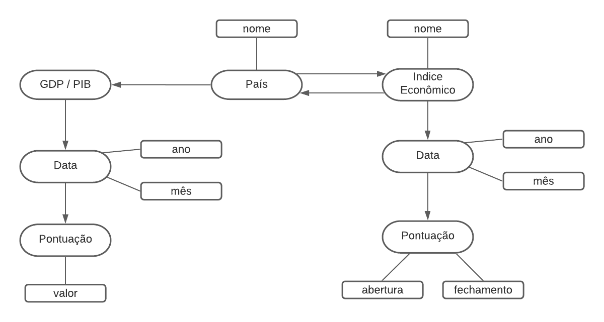

# Lab09 - Grafo De Conhecimento

Estrutura de pastas:

~~~
├── README.md  <- arquivo apresentando a tarefa
│
└── images     <- arquivos de imagem usados na tarefa
~~~

# Aluno
* `201270`: `Leonardo Rener de Oliveira`

## Laboratório 9 - Etapa 5 - Grafo De Conhecimento

> 

## Perguntas de Pesquisa/análise

> * Qual o indice com maior valorização no ano de 2015?
>
> * Qual o PIB desse pais no mesmo ano? ouve crescimento em relação ao ano anterior?
> 
> * Qual o nome de todos os indeces economicos mundiais que obtiverem crescimento em 2020?
>
